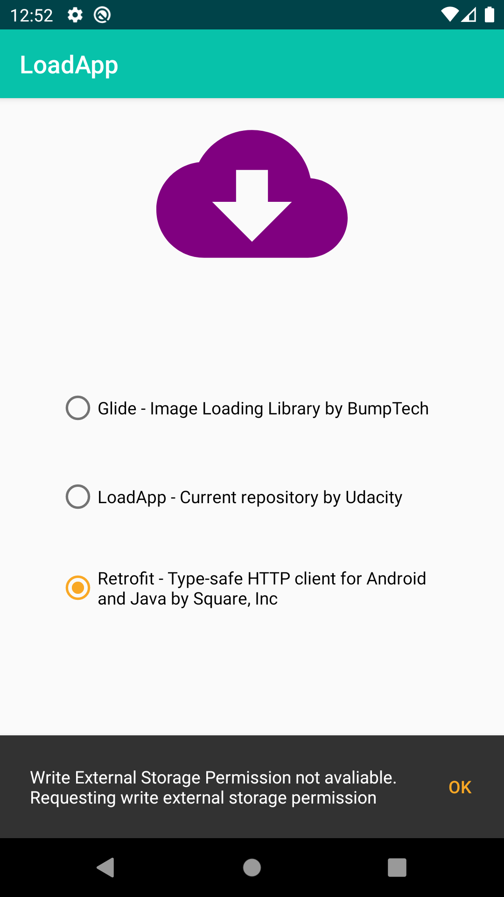
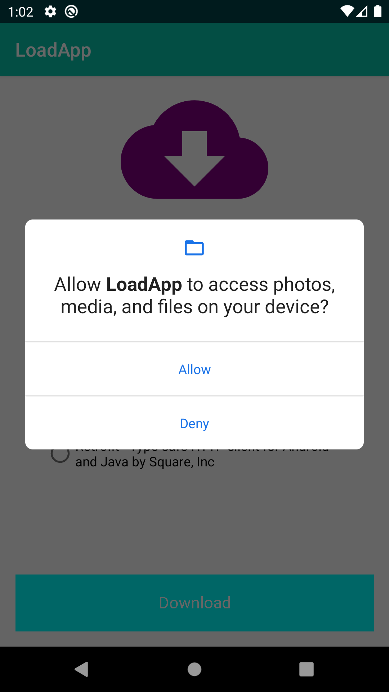

# LoadApp

In this project the application downloads a file from Internet by clicking on a custom-built button where:
 - width of the button gets animated from left to right;
 - text gets changed based on different states of the button;
 - circle gets be animated from 0 to 360 degrees

A notification will be sent once the download is complete. When a user clicks on notification, the user lands on detail activity and the notification gets dismissed. In detail activity, the status of the download will be displayed and animated via MotionLayout upon opening the activity.

[The final look of the app](https://gph.is/g/Zywmnre)

## Permission

The application shows how to use the new runtime permissions API to check and request permissions through the androidx.activity library.
Android 11 introduced new permissions behaviours, like "ask every time" option, and introduce a
default method [`ActivityResultContracts.RequestPermission()`][2]. 
The method take care of the main flows for the developer.
The application introduces the basic use of the runtime permissions API through the androidx library by
verifying permissions [(ContextCompat#checkSelfPermission(Context, String))][3], requesting
permissions (ActivityResultContracts.RequestPermission()) and handling the permission request callback 
(androidx.activity.result.ActivityResultCaller.registerForActivityResult).
An application can display additional context and justification for a permission after calling
[ActivityCompat#shouldShowRequestPermissionRationale(Activity, String)][4].

Screenshots
-------------

 
 


### Dependencies

```
    implementation fileTree(dir: 'libs', include: ['*.jar'])
    implementation "org.jetbrains.kotlin:kotlin-stdlib-jdk7:$kotlin_version"
    implementation 'androidx.appcompat:appcompat:1.0.2'
    implementation 'androidx.core:core-ktx:1.0.2'
    testImplementation 'junit:junit:4.12'
    androidTestImplementation 'androidx.test:runner:1.1.1'
    androidTestImplementation 'androidx.test.espresso:espresso-core:3.1.1'
    implementation 'com.jakewharton.timber:timber:4.7.1'
    implementation 'androidx.activity:activity-ktx:1.2.2'
    implementation 'androidx.fragment:fragment-ktx:1.3.1'
```

### Installation

Step by step explanation of how to get a dev environment running.

List out the steps:

```
1. Open Android Studio Application
2. Choose "Open an existing Android Studio Project"
3. In the opened finder find `nd940-c3-advanced-android-programming-project-starter` folder
4. Click on the folder and select `starter` folder and click on "Open" button
5. Once the project is opened in Android studio, go to File -> Sync Project with gradle files
6. Click on "Run" button in Android Studio to install the project on the phone or emulator
```

## Testing

Explain the steps needed to run any automated tests

### Break Down Tests

Explain what each test does and why

```
Examples here
```
## Project Instructions

This section should contain all the student deliverables for this project.

## Built With

* [Android Studio](https://developer.android.com/studio) - Default IDE used to build android apps
* [Kotlin](https://kotlinlang.org/) - Default language used to build this project

Include all items used to build project.

[1]: https://developer.android.com/reference/androidx/activity/result/ActivityResultCaller#registerForActivityResult(androidx.activity.result.contract.ActivityResultContract%3CI,%20O%3E,%20androidx.activity.result.ActivityResultCallback%3CO%3E)
[2]: https://developer.android.com/reference/androidx/activity/result/contract/ActivityResultContracts.RequestPermission
[3]: https://developer.android.com/reference/androidx/core/content/ContextCompat#checkSelfPermission(android.content.Context,%20java.lang.String)
[4]: https://developer.android.com/reference/androidx/core/app/ActivityCompat#shouldShowRequestPermissionRationale(android.app.Activity,%20java.lang.String)


## License
Please review the following [license agreement](https://bumptech.github.io/glide/dev/open-source-licenses.html)